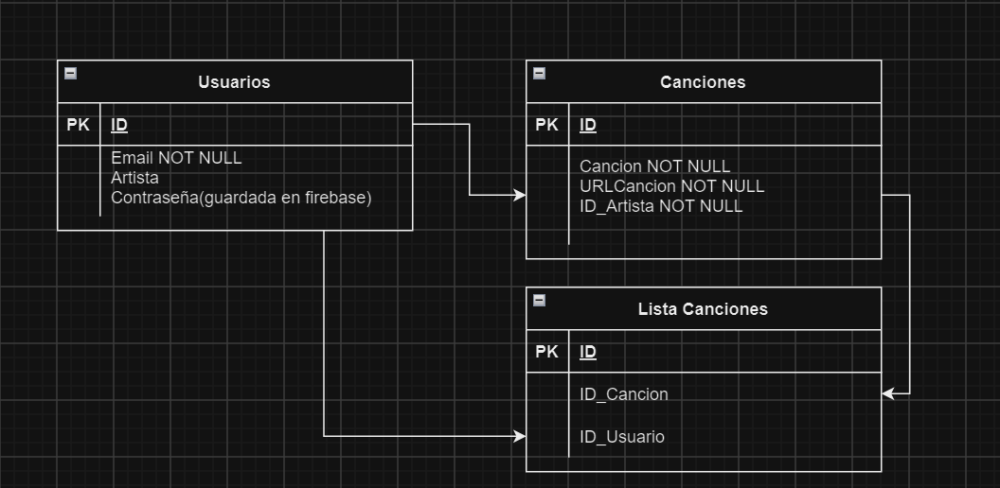

# Reproductor

Descripción General
El objetivo del proyecto es desarrollar un reproductor web de música que permita a los usuarios escuchar música, sin necesidad de iniciar sesión. Sin embargo, para acceder a ciertas funciones, como la escucha de estaciones de radio y la subida de música como artista, los usuarios deberán registrarse e iniciar sesión.

# Parte 1: Requerimientos iniciales

   
   1.1 Autenticación de Usuarios
   Registro de Usuarios: Los usuarios podrán registrarse como artistas utilizando su correo electrónico y una contraseña.
   Inicio de Sesión: Los usuarios podrán iniciar sesión con su correo electrónico y contraseña.
   Logout: Los usuarios tendrán la opción de cerrar sesión en cualquier momento.
   Recuperación de Contraseña: Se implementará un mecanismo de “Olvidé mi contraseña” que permitirá a los usuarios restablecer su contraseña mediante el envío de un correo   electrónico a través de Firebase.
   
   1.2 Gestión de Usuarios
   Edición de Perfil: Los usuarios podrán editar su perfil, incluyendo su nombre, dirección de correo electrónico y foto de perfil.
   Baja de Usuario: Los usuarios tendrán la opción de eliminar su cuenta de la plataforma en cualquier momento.
   
   1.3 Reproductor de Música
   Escucha de Música: Los usuarios podrán escuchar música sin necesidad de registrarse.
   Escucha de Radio: Solo los usuarios registrados podrán escuchar las estaciones de radio fijas disponibles en la plataforma.
   
   1.4 Subida de Música
   Registro como Artista: Los usuarios que se registren como artistas podrán subir su propia música al reproductor.
   Listado de Música: Todos los usuarios podrán ver un listado de la música disponible, incluyendo canciones subidas por otros artistas.
   
   1.5 Listado y Detalles de Recursos
   Listado de Canciones: Habrá una pantalla que muestre un listado de todas las canciones disponibles en la plataforma.
   Detalles de Canción: Al hacer clic en una canción del listado, se mostrarán todos sus detalles, incluyendo información del artista, duración, género, y cualquier otra información relevante.
   
   1.6 Edición y Eliminación de Recursos
   Edición de Canciones: Los artistas podrán editar la información de las canciones que hayan subido, como el título, artista, y otros detalles.
   Eliminación de Canciones: Los artistas tendrán la opción de eliminar las canciones que hayan subido si así lo desean.

   # Parte 2: Modelo de datos
   Este será el esquema de mi base de datos en firestore aunque sea una base noSQL es pra representarlo de alguna manera



# Parte 3: Prototipado simple del sitio web

   En la carpeta de moqups hay distintos html con una idea de como quedaria el proyecto final

# Parte 4: Desarrollo del backend

   He comenzado usando el framewok vue directamnete. 
   El Inicio de sesion esta en usuarioView.vue .
   El Registro en registroView.vue. 
   El formulario para añdir musica en formularioView.vue . 
   Para ver la lista de  musica almacenada en firestore musicaView.vue (aparte añade un buscador)
   Para contraseña perdida forgotPasswordView.vue . 

   Por ahora he probado en guardar las canciones en Storage de firebase para poder despues reproducirlo por ahora lo reproduce en playerView.vue pero quiero cambiar alguna cosa.

   Tambien he añadido un api para reproducir radios la he configurado para que sean radios españolas esta en radioView.vue.

## Project setup
```
npm install
```

### Compiles and hot-reloads for development
```
npm run serve
```

### Compiles and minifies for production
```
npm run build
```

### Lints and fixes files
```
npm run lint
```

### Customize configuration
See [Configuration Reference](https://cli.vuejs.org/config/).
